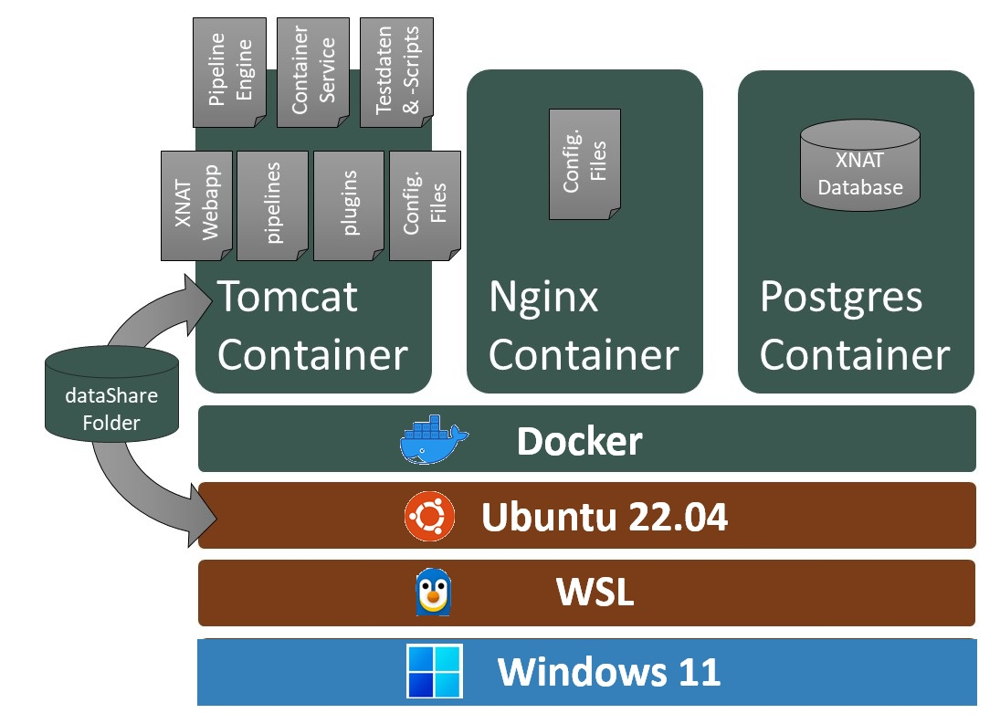
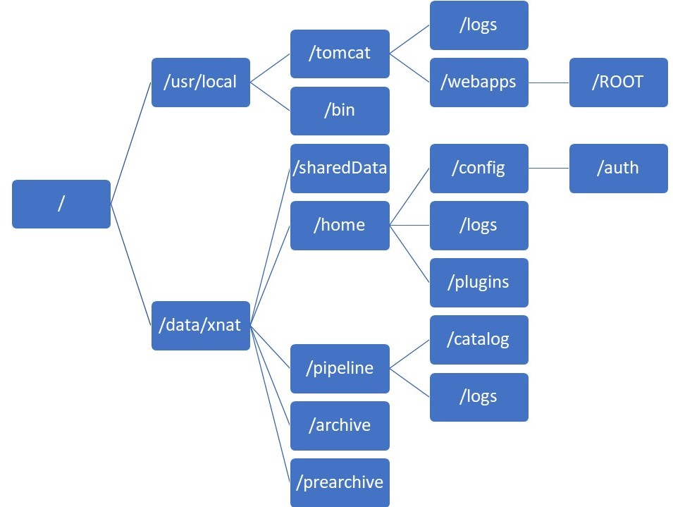
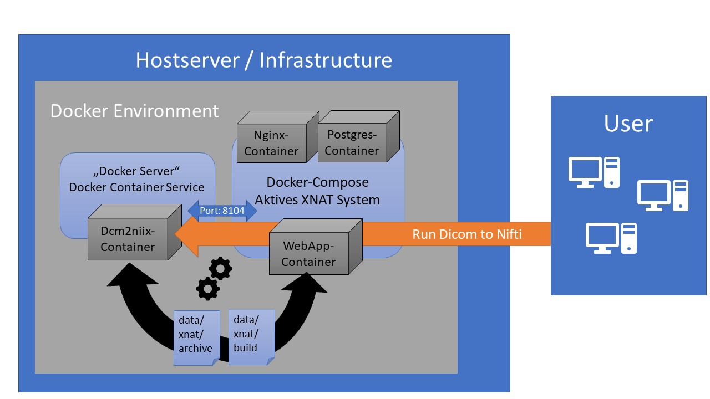

# Xnat-Ubuntu on WSL
Ir's based on [Adrian Pfleiderer's projet Xnat-ubuntu](hhttps://github.com/Pfleiderer-Adrian/Xnat-Ubuntu) which itself was a modified dockerized XNAT version from the [official dockerized XNAT Git-Repo](http://github.com/NrgXnat/xnat-docker-compose) with the following changes.

* this Xnat is modified and optimized for Ubuntu
* simple installation Script (work out of the box)
* installed OHIF Viewer & LDAP Plugin
* installed Docker-Pipeline-Engine
* installed Container Plugin + Workaround
* fixed Processing URL BUG
* some specific Ubuntu changes
* APItest Script and TestPipeline
* Access a web server which is running on WSL (Windows Subsystem for Linux) from the local network

## System Overview
A short environment overview with the different docker container and subsystems.



## Preconditions
* Ubuntu Server (>18)
* wsl 1

Ubuntu sur Windows est une variante d'Ubuntu proposée officiellement par Microsoft et Canonical, et qui se déploie nativement sur Windows 10 ou Windows 11 au moyen du sous-système WSL.

## Usage
* Install Ubuntu on WSL on Windows 10\
On Ubuntu: 
* download the installScript.sh file
* copy the file to your Ubuntu Server in your root directory (Command: cd /)
* execute the file with the command: sudo bash installScript.sh
* after the installation and several minutes, look at your URL http://127.0.0.1/
* now make the necessary configuration to access the web server from the local network
* now make the necessary configuration (processing url & admin password change)


## Enable WSL
Enable the WSL (Windows Subsystem for Linux) option in Windows Optional Features panel. Open PowerShell as Administrator and run
```
dism.exe /online /enable-feature /featurename:Microsoft-Windows-Subsystem-Linux /all /norestart

dism.exe /online /enable-feature /featurename:VirtualMachinePlatform /all /norestart
```

## Configuration to ccess the web server from the local network
* check the ip of my ubuntu machine
```
$ ip add | grep "eth0"
```
In my cese the reponse is 129.20.25.15

* Open PowerShell as Administrator and run:
```
> netsh interface portproxy add v4tov4 listenport=443 listenaddress=0.0.0.0 connectport=443 connectaddress=172.29.34.5
```

Now you can access the web server from the local network, in my case https://129.20.25.15

## Necessary Configurations
* first change your admin password (default credentials -> Name: admin, PW: admin)
* change processing url to your side url under Administer -> Site Administration -> Pipeline Settings -> Processing Url
* change the side url to your side url under Administer -> Site Administration -> Site Setup -> Site Url

## Start the system

```
~/Xnat-Ubuntu$ sudo docker-compose up -d
```
(more information on: https://github.com/NrgXnat/xnat-docker-compose)

## Folder Overview
A short overview of the XNAT folderstructure after a successful installation.



## Pipeline Configurations
### Add "Execute Pipeline"-Button on Options Menu in SessionData
* navigate: Administer -> Data Types -> 
* choose SessionData Element witch should have Execute option
* click on the Element and on Edit-Button
* scroll down to "Available Report Actions"
* one the last entry in this table write: Name->PipelineScreen_launch_pipeline, Display Name->Build, Secure Access->edit
* scroll down again and click on the "Submit"-Button

Now should appear a "Execute Pipeline"-Button when you open a Project with the specific SessionData Element. There you can execute a Pipeline for the Project Data if you have added a Pipeline.

### Add a Pipeline to your XNAT System
You can add a Sample Pipeline that is already installed with this installation.
* navigate: Administer -> Pipeline -> Add Pipeline
* choose the path: /data/xnat/pipeline/catalog/PipelineTest/SampleHelloWorldPipeline.xml
* Importend!! leave the Name Textfield empty. A Bug will accur with you choose a spezific name. 
* after confirm your settings you can add this pipeline to your project and test the pipeline engine

### Container Service
With this installation you can also add docker container as pipelines. Here a short example how it works with a external docker environment.




## Special mention
* Sourcefiles from offical XNAT Repo: [github.com/NrgXnat/xnat-docker-compose](http://github.com/NrgXnat/xnat-docker-compose)  [@johnflavin](http://github.com/johnflavin)
* Fork for [Adrian Pfleiderer's projet Xnat-ubuntu](hhttps://github.com/Pfleiderer-Adrian/Xnat-Ubuntu)

